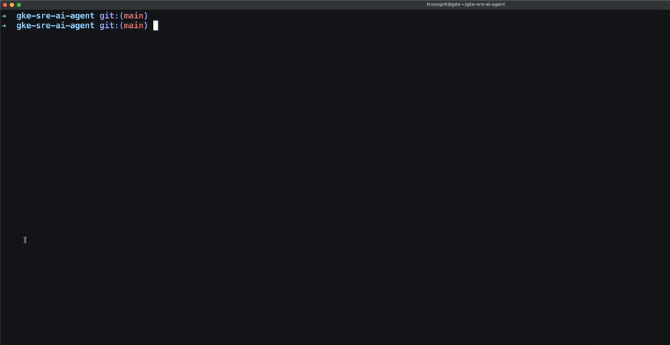

# gke-sre-ai-agent

> Ships the **`gke-scout`** CLI — an AI on-call SRE for Google Kubernetes Engine.

Point it at a broken workload; it investigates **read-only**, writes an
evidence-cited root-cause report, and never touches your cluster. Under the
hood it uses the Antigravity CLI (`agy`, powered by Gemini) talking to the
GKE MCP server through a safety guardrail proxy.

**Technical Deep-Dive**: https://truongnh-gde.dev/gke-sre-ai-agent.html

## Prerequisites

Before you start, make sure you have these installed and configured:

| Tool | Purpose | Install |
|------|---------|---------|
| **gcloud** | Google Cloud auth | [Install guide](https://cloud.google.com/sdk/docs/install) |
| **kubectl** | Kubernetes context | Bundled with `gcloud components install kubectl` |
| **agy** | AI reasoning engine (Antigravity CLI) | `go install github.com/anthropics/antigravity@latest` or your org's install method |
| **uv** | Python package manager | `curl -LsSf https://astral.sh/uv/install.sh \| sh` |

## Demo



## Quick start

### 1. Authenticate with Google Cloud

```console
gcloud auth login
gcloud auth application-default login   # needed for the guardrail proxy
```

### 2. Connect to your GKE cluster

```console
gcloud container clusters get-credentials CLUSTER_NAME \
  --region REGION --project PROJECT_ID
```

Verify with `kubectl get nodes` — you should see your cluster's nodes.

### 3. Install gke-scout

```console
git clone https://github.com/truongnh1992/gke-sre-ai-agent.git
cd gke-sre-ai-agent
uv tool install .
```

### 4. Initialize config

```console
gke-scout init                # creates ~/.gke-scout/config.yaml
```

### 5. Import the guardrail into agy

```console
gke-scout register            # registers the MCP server + installs the skill
agy plugin import gemini       # imports into agy's plugin registry
```

> You only need to run this once. `gke-scout diagnose` also auto-registers
> before each run, so this step is optional.

### 6. Diagnose a workload

```console
gke-scout diagnose <DEPLOYMENT_NAME>
```

That's it. A spinner shows progress while the agent investigates. When it
finishes, a Markdown report appears in `./gke-scout-out/`.

## Usage examples

```console
# Diagnose a deployment in the default namespace
gke-scout diagnose frontend

# Specify a namespace
gke-scout diagnose payment-service -n payments

# See raw engine output (useful for debugging)
gke-scout diagnose frontend --verbose

# Set a custom timeout (default: 5 minutes)
gke-scout diagnose frontend --timeout 120

# Use Gemini CLI instead of agy
gke-scout diagnose frontend --engine gemini
```

## What the output looks like

Reports are saved to `./gke-scout-out/<workload>-report.md` and contain:

- **Root cause** — a one-sentence diagnosis
- **Confidence** — `high`, `medium`, or `low`
- **Findings** — evidence-cited details (pod status, events, logs)

Low-confidence runs list ranked hypotheses instead.

<details>
<summary>Example report (click to expand)</summary>

```markdown
# Triage report: storefront (namespace: default)

**Confidence:** high

## Root cause

The ConfigMap 'demo-data-config' in namespace 'default' is missing the key 'DEMO_LOGIN_USERNAME', which is required to set the environment variable 'DEFAULT_USERNAME' in the storefront container.

## Evidence

### The storefront pod is stuck in a 'CreateContainerConfigError' status because a referenced ConfigMap key does not exist.
- Pod status: The pod 'storefront-74468d95fc-csvxd' shows STATUS 'CreateContainerConfigError'.
- Pod event details: Warning event reports 'Error: couldn't find key DEMO_LOGIN_USERNAME in ConfigMap default/demo-data-config'.
- Container environment reference: Environment variable 'DEFAULT_USERNAME' is configured to retrieve its value from key 'DEMO_LOGIN_USERNAME' of config map 'demo-data-config'.
```

</details>

## How it works

```
You run:  gke-scout diagnose frontend
                    │
                    ▼
          ┌─────────────────┐
          │  gke-scout CLI  │  builds prompt, starts agy
          └────────┬────────┘
                   │
                   ▼
          ┌─────────────────┐
          │   agy (Gemini)  │  AI agent reasons + calls MCP tools
          └────────┬────────┘
                   │ stdio
                   ▼
          ┌─────────────────┐
          │ guardrail proxy │  blocks writes, redacts secrets, audits
          └────────┬────────┘
                   │ HTTPS
                   ▼
          ┌─────────────────┐
          │  GKE MCP server │  container.googleapis.com/mcp
          └─────────────────┘
```

The guardrail proxy sits between the AI agent and your cluster. It:
- **Blocks** any mutating call (apply, patch, delete, scale, exec)
- **Redacts** secrets and sensitive values from API responses
- **Logs** every tool call to `~/.gke-scout/audit.jsonl`

## Troubleshooting

| Problem | Fix |
|---------|-----|
| `gke-scout: command not found` | Run `uv tool install .` from the repo root |
| Timeout errors | Increase with `--timeout 600` (seconds) |
| `ADC auth failed` | Run `gcloud auth application-default login` |
| Agent uses wrong cluster | Check `kubectl config current-context` |
| Empty or inconclusive report | Re-run with `--verbose` to see raw output |

## License

This project is licensed under the MIT License. See the [LICENSE](LICENSE) file for more information.

> Google Cloud credits are provided for this project.
